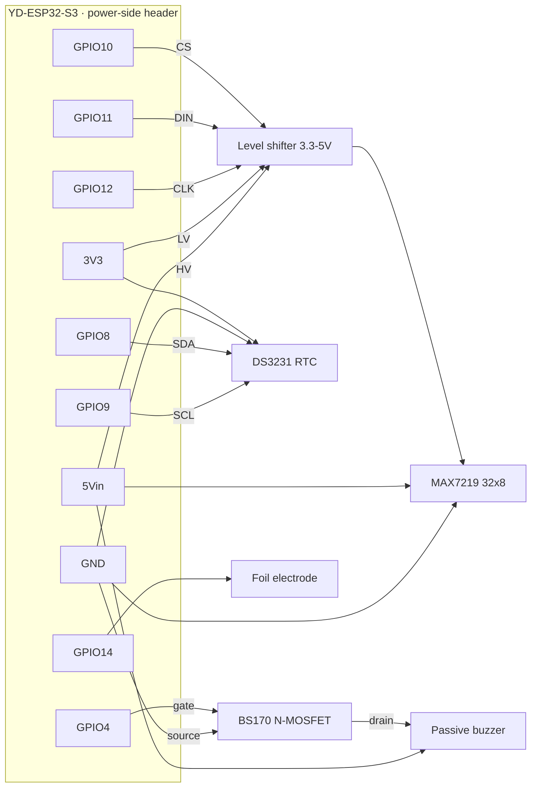

# Smart Alarm Clock

A custom-hardware, embedded-Rust, Home-Assistant-aware bedside **smart alarm clock**.
Aesthetic: **"dark & silent until summoned"** — a minimal wood-veneer bar that shows
nothing until a touch reveals the time through the veneer. Fully integrated with Home
Assistant, but fires alarms **on-device** so it works even if WiFi/HA is down.

> Firmware + a Home Assistant integration already work; the current phase is **breadboard
> bench validation** before committing to a PCB. See `docs/handoff.md` for the locked design.

## Repository layout

```
software/
  firmware/       Rust (esp-idf) firmware for the ESP32-S3 — the device itself
  homeassistant/  Home Assistant custom integration (Python) + docs
  tools/          sim_device.py — a Python simulator of the device (REST + SSE) for HA testing
hardware/         PCB + enclosure (KiCad, veneer bar) + bench wiring diagram
docs/             Locked design + reasoning (handoff.md)
```

Firmware commands below run from `software/firmware/`.

## Hardware (v1)

- **MCU:** ESP32-S3-WROOM-1 (native USB-JTAG). Bench board: YD-ESP32-S3 devkit.
- **Time:** SNTP + DS3231 RTC + supercap backup (no battery)
- **Power:** USB-C mains only, 5V → 3.3V buck (supercap backs the RTC only)
- **Display:** monochrome dot-matrix showing **time only** behind warm wood veneer, OFF when idle. Bench: red MAX7219 32×8; final: a warm/amber emitter (PCB-stage). Status (armed/ringing/…) via a single RGB LED (onboard WS2812).
- **Interaction:** native ESP32-S3 **capacitive touch** (foil/copper electrode behind the veneer, tap/hold) — senses through wood, so no IR-passthrough problem. Rear buttons available.
- **Audio:** passive buzzer via LEDC/PWM (BS170 low-side switch). Real audio (I²S + HA `media_player`) is a future option (see below).

## Bench validation

Get the device working end-to-end on a breadboard before committing to a PCB. Every part below
has a firmware hook that already exists (scaffolded) or is the immediate next thing to wire. Uses
the **existing dev board** and **on-hand buttons**. EU sourcing (Tinytronics / Antratek / AliExpress);
prices are rough guides.

### Parts

Single-sourced at **Tinytronics** except the veneer (and, later, copper tape).

| Part | Serves | Firmware hook | ~€ |
|---|---|---|---|
| **LED Matrix 32×8 with MAX7219** (red, 3-wire SPI-like; SKU 003516) | shows `HH:MM` (time only) — validate 4-digit layout/legibility/geometry behind veneer | matrix time render (to wire) | 6 |
| **Keyestudio DS3231 RTC** module (I²C, SKU 005849) | correct time on boot + offline alarm firing | RTC read/set fallback (scaffolded) | 4 |
| **Passive Buzzer 3-12V — Dupont-Jumper** (passive → PWM tones) | v1 wake sound | LEDC/PWM (`buzzer.rs`) | 1 |
| **4-channel Bi-Directional Logic Level Converter** (3.3↔5 V, BSS138) | reliable data into the 5 V MAX7219 from 3.3 V ESP32 | — | 1.5 |
| **Capacitive-touch electrode** — kitchen foil / jumper (proper copper tape later, *not* at Tinytronics) | tap + hold gestures via the ESP32-S3's **native** touch peripheral, no sensor chip | touch → `Command` bus (to wire) | ~0 |
| **Wood veneer sample pack** (~0.6 mm; walnut/oak/etc.) — *source elsewhere* | display glow-through look **and** capacitive-touch-through-veneer tuning | — | 5–10 |
| Decoupling caps (100 nF / 10 µF) | supporting | — | 2 |
| *Optional:* single **SK6812 / WS2812** discrete pixel | final placement of the RGB status LED (onboard WS2812 covers the bench) | already driven in `led.rs` | 1–2 |
| *Optional:* **Logic Analyzer 8-channel USB** | SPI/I²C bring-up debugging (sigrok/PulseView) | — | 9.75 |

**Core subtotal: ~€12.50** (matrix + RTC + buzzer + level converter), + ~€10 optional logic analyzer.
**Spares:** order **2× MAX7219 matrix** and **2× level converter** (1 spare each, +€7.50) — these
parts don't wear out, but a wiring slip in the mixed 3.3/5 V path plus a reorder's shipping/wait
dwarfs the part cost.

**Status (2026-07-27):** parts ordered + arrived (electronics); wood veneer still to source. Buzzer
firmware written; breadboard bring-up is waiting on a soldering iron to attach the dev-board header.

### Wiring

Every signal lands on the YD-ESP32-S3 **power-side header** (the `5Vin` / `3V3` / `RST` row), so one
soldered header covers the whole bench. Full pin plan + gotchas: [`hardware/bench-wiring.md`](hardware/bench-wiring.md).



**Wiring notes:**
- **DS3231 at 3.3 V, not 5 V** — its onboard I²C pull-ups reference VCC; 5 V would over-volt the S3's pins. It keeps perfect time at 3.3 V. I²C scan should ACK at `0x68`.
- **MAX7219 is 5 V logic** — drive DIN/CLK/CS through the level shifter; power the matrix from `5Vin`, keep brightness modest on USB.
- **Buzzer** — `GPIO4` → BS170 gate (low-side switch), drain → buzzer → `5Vin`. Gate held low by the ESP32-S3's internal pulldown; no external resistor.
- **Capacitive touch** — foil electrode on `GPIO14`; **no pull resistor** (it interferes with sensing). Fallback if touch feels wrong: a GY-APDS-9900 IR-reflective proximity module (I²C, ~€3.50), which reintroduces the IR-through-veneer test.

### Bring-up sequence

1. Solder the dev-board header, then bring up peripherals **one at a time**: RTC (I²C scan → `0x68`) → buzzer → MAX7219 `HH:MM` render → capacitive touch. Prove the `HH:MM` glow, capacitive-touch-through-veneer, and the warm look before a PCB.
2. Flesh out firmware on the breadboard: RTC read, matrix render, touch input + tuning, NVS persistence.
3. KiCad schematic → ERC → 2-layer layout → DRC → Gerbers → order.
4. Bring up the bare board incrementally; iterate the veneer enclosure.

### Deferred to PCB stage (bench uses the simpler thing)

- **RTC backup: supercap instead of the coin cell.** Wire the supercap on the DS3231 **VBAT** pin (across the coin-cell pads), *not* VCC — VBAT is the low-power (~1 µA) backup input. The DS3231 does **not** charge VBAT, so add a trickle path from VCC: `VCC → R (few hundΩ–1k) → Schottky → supercap → GND`, cap rated ≥ VCC (VBAT max 5.5 V). For the bench, just use the CR1220.
- **Warm display emitter.** The bench matrix is red; source a warm/amber ~32×8 emitter once the veneer test confirms the geometry.

## Firmware structure

Lives in `software/firmware/` (entry point `src/main.rs`). `std` path (`esp-idf-hal` +
`esp-idf-svc`), FreeRTOS exposed as `std::thread` — worker threads over shared state behind
`Arc<Mutex<…>>`. Every input (button, REST, MQTT) pushes the same `Command`s onto one bus;
the alarm core is the sole writer.

| Worker | Role |
| --- | --- |
| alarm | **Source of truth** — 8-slot model, state machine, firing, snooze/dismiss. Never blocks on network. |
| net | SoftAP + captive portal, HTTP REST API + web UI, SSE push (:81), mDNS, MQTT discovery/LWT. |
| button | BOOT button → commands. |
| buzzer | Passive buzzer via LEDC — beeps while ringing. |
| led | Onboard WS2812 phase colors (status LED). |

Working: alarm core, SNTP wall-clock firing, web UI + captive portal, MQTT + custom HA integration.
Bench TODOs: DS3231 RTC read, MAX7219 time render, capacitive-touch input, NVS persistence. See
`docs/handoff.md` for the full design.

## Toolchain setup

This is the Xtensa ESP32-S3 target on the `std`/esp-idf path, so it needs the
Espressif Rust fork (not stock `rustup`):

```sh
# 1. Install the Xtensa Rust toolchain + flashing tools
cargo install espup ldproxy espflash cargo-espflash --locked
espup install                 # installs the esp/xtensa toolchain + LLVM
. $HOME/export-esp.sh         # exports env each shell (source it, or add to your profile)

# 2. Build + flash + monitor over native USB-C
cd software/firmware          # the firmware crate lives here
cargo run                     # builds for esp32s3 and flashes (see software/firmware/.cargo/config.toml runner)
```

`software/firmware/rust-toolchain.toml` pins the `esp` channel and `software/firmware/.cargo/config.toml` sets the
`xtensa-esp32s3-espidf` target + `espflash flash --monitor` runner, so a plain
`cargo run` builds and flashes. In **RustRover**, the **Flash + monitor** run configuration
(`.run/`) does the same.

> **If flashing can't connect** (`espflash`: "Error while connecting to device"):
> it's almost always a **charge-only USB cable** — it enumerates the serial port but
> the chip never syncs. Use a real **data** cable; then normal auto-reset works and no
> BOOT-button sequence is needed. Sanity-check the chip with
> `espflash board-info --port <PORT>` (this board reports **ESP32-S3**).

### TTGO T-Display test board

For a classic ESP32 TTGO T-Display, use the ESP32 target profile:

```sh
cargo build-ttgo   # build only
cargo run-ttgo     # build + flash + monitor (= cargo run --target xtensa-esp32-espidf)
```

The default `cargo build` / `cargo run` stays on the final ESP32-S3 target.

The esp-idf build config is **already included** under `software/firmware/` — `.cargo/config.toml`,
`rust-toolchain.toml`, `sdkconfig.defaults`, and `build.rs`. On the first build, `esp-idf-sys`
downloads and builds ESP-IDF `v5.2.3` (pinned in `.cargo/config.toml`), which takes a while; later
builds are fast.

## Future option — real audio / HA media player

The v1 buzzer could later be replaced by real audio: a **default tone stored on device** (offline
wake sound), **user-uploadable sound files**, and registering as an **HA `media_player`** (HA pushes
TTS / chimes / radio). Parts to add (~€20): an **ESP32-S3-DevKitC-1 N16R8** (16 MB flash for uploads +
8 MB PSRAM to buffer/decode streams — the current board has neither), a **MAX98357A** I²S amp, and a
3–4 W speaker. Open decisions: WAV vs MP3 for uploads; Rust vs ESPHome for the `media_player` (the
Rust path is a large firmware lift, ESPHome provides it natively but would replace the current firmware).

## Open questions

- Warm display-emitter sourcing (bench uses red).
- Capacitive-touch-through-veneer tuning (electrode size, thresholds, groundless USB supply).
- Per-slot fields (repeat days / sound / sunrise) → drives the HA entity set + NVS schema.
- Enclosure dimensions; budget + fab (JLCPCB vs Aisler).
