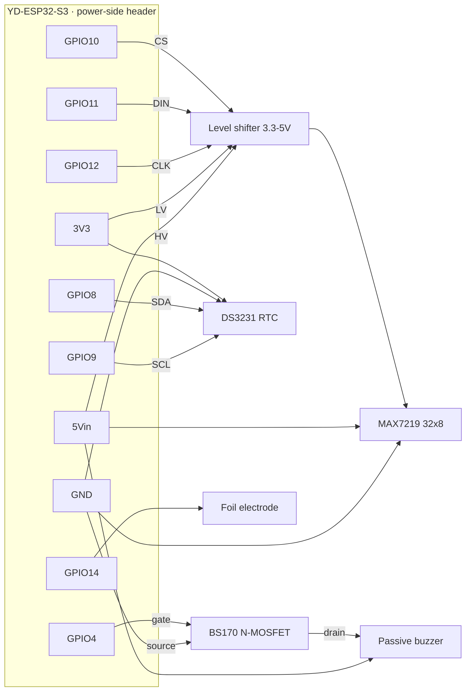

# Smart Alarm Clock

A custom-hardware, embedded-Rust, Home-Assistant-aware bedside **smart alarm clock**.
Aesthetic: **"dark & silent until summoned"** — a minimal wood-veneer bar that shows
nothing until a proximity gesture reveals the time through the veneer. Fully integrated
with Home Assistant, but fires alarms **on-device** so it works even if WiFi/HA is down.

> This is a **light scaffold** to start the firmware. The core logic is intentionally
> left as `TODO`s — the project owner is learning embedded Rust and wants to write it.
> See `docs/` for the locked design and the options/trade-offs reference.

## Repository layout

```
software/
  firmware/       Rust (esp-idf) firmware for the ESP32-S3 — the device itself
  homeassistant/  Home Assistant custom integration (Python) + docs
  tools/          sim_device.py — a Python simulator of the device (REST + SSE) for HA testing
hardware/         PCB + enclosure (KiCad, veneer bar) — see docs/bench-bom.md
docs/             Locked design (handoff.md), bench BOM (bench-bom.md)
```

Firmware commands below run from `software/firmware/`.

## Hardware (v1)

- **MCU:** ESP32-S3-WROOM-1 (native USB-JTAG for program + debug)
- **Time:** NTP (SNTP) primary + DS3231 RTC + supercap backup (no battery)
- **Power:** USB-C mains only, 5V → 3.3V buck (supercap backs the RTC only)
- **Display:** diffused warm dot-matrix LED panel behind thin wood veneer (APA102/SK9822 SPI preferred), driven OFF when idle
- **Interaction:** single VCNL4040 (proximity gesture + ambient lux) over I²C; 3 rear buttons
- **Audio:** passive piezo + RTTTL (one LEDC/PWM GPIO); I²S DAC pads reserved for v2

## Bench wiring

High-level breadboard wiring for bench validation on the **YD-ESP32-S3** — every signal lands on
the one power-side header. Full pin plan + gotchas in [`hardware/bench-wiring.md`](hardware/bench-wiring.md).



## Firmware structure

The firmware lives in `software/firmware/` (entry point `software/firmware/src/main.rs`).

Planned target design (`std` path: `esp-idf-hal` + `esp-idf-svc`, FreeRTOS underneath
exposed as `std::thread`): four threads with shared state behind `Arc<Mutex<…>>` /
channels. Not yet created — this is the roadmap to implement:

| Thread | Role |
| --- | --- |
| Alarm / time | **Source of truth.** RTC, preset eval, firing, snooze/dismiss. Never blocks on network. |
| Network | MQTT (HA discovery + LWT), HTTP web UI, mDNS, AP/captive portal, SNTP. |
| Interaction | VCNL4040 gesture + lux, rear buttons, brightness. |
| Display | Renders time / alarm / preset / armed / dismiss-progress; fades. |
| Shared state | Alarm model (fixed pool of 8 slots) + state machine + settings (NVS-backed). |

See `docs/handoff.md` for the full locked design behind this.

## Toolchain setup

This is the Xtensa ESP32-S3 target on the `std`/esp-idf path, so it needs the
Espressif Rust fork (not stock `rustup`):

```sh
# 1. Install the Xtensa Rust toolchain + flashing tools
cargo install espup ldproxy espflash cargo-espflash --locked
espup install                 # installs the esp/xtensa toolchain + LLVM
. $HOME/export-esp.sh         # exports env each shell (source it, or add to your profile)

# 2. Build + flash + monitor over native USB-C
cd software/firmware          # the firmware crate lives here
cargo run                     # builds for esp32s3 and flashes (see software/firmware/.cargo/config.toml runner)
```

`software/firmware/rust-toolchain.toml` pins the `esp` channel and `software/firmware/.cargo/config.toml` sets the
`xtensa-esp32s3-espidf` target + `espflash flash --monitor` runner, so a plain
`cargo run` builds and flashes. The scaffold depends directly on `esp-idf-sys`;
add `esp-idf-hal` / `esp-idf-svc` when you start wiring peripherals and services.
In **RustRover**, the **Flash + monitor** run configuration (`.run/`) does the same.

> **If flashing can't connect** (`espflash`: "Error while connecting to device"):
> it's almost always a **charge-only USB cable** — it enumerates the serial port but
> the chip never syncs. Use a real **data** cable; then normal auto-reset works and no
> BOOT-button sequence is needed. Sanity-check the chip with
> `espflash board-info --port <PORT>` (this board reports **ESP32-S3**).

### TTGO T-Display test board

For a classic ESP32 TTGO T-Display, use the ESP32 target profile:

```sh
# Build only
cargo build-ttgo

# Build + flash + monitor
cargo run-ttgo
```

This is equivalent to:

```sh
cargo run --target xtensa-esp32-espidf
```

The default `cargo build` / `cargo run` stays on the final ESP32-S3 target. If your
board is the newer **T-Display-S3**, use the default ESP32-S3 profile instead.

The esp-idf build config is **already included** under `software/firmware/` —
`.cargo/config.toml`, `rust-toolchain.toml`, `sdkconfig.defaults`, and `build.rs`. On the
first build, `esp-idf-sys` downloads and builds ESP-IDF `v5.2.3` (pinned in `.cargo/config.toml`),
which takes a while; later builds are fast. Reference: Espressif's "Embedded Rust on
ESP" book (covers WiFi + MQTT).

## Build sequence (from the design)

1. **Bench validation first (~€60):** dev-kit S3 + VCNL4040 + DS3231(supercap) +
   warm matrix + piezo + 3 buttons + wood-veneer samples. Prove IR-through-veneer,
   the proximity gesture, and the warm glow before committing to a PCB.
2. Validate firmware on the breadboard (gestures + guards, presets in NVS, web UI +
   captive portal + mDNS, on-device firing, MQTT discovery/parity/LWT, RTC + NTP).
3. KiCad schematic → ERC → 2-layer layout → DRC → Gerbers → order.
4. Bring up the bare board incrementally; iterate the veneer enclosure.

## Open questions

See `docs/` — display panel sourcing, veneer IR passthrough (bench test), preset
model specifics, enclosure dimensions, budget/fab (JLCPCB vs Aisler).
