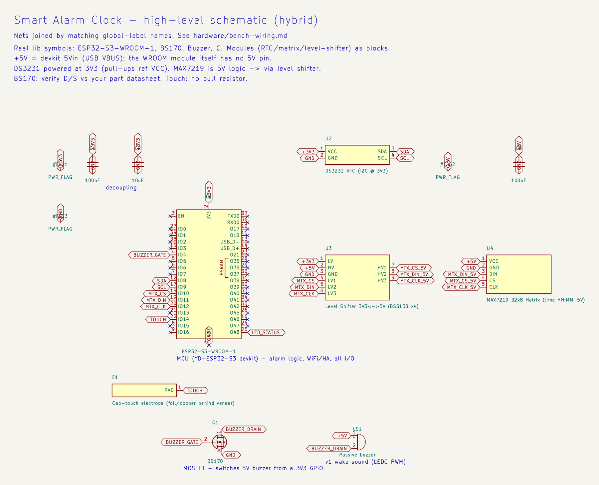
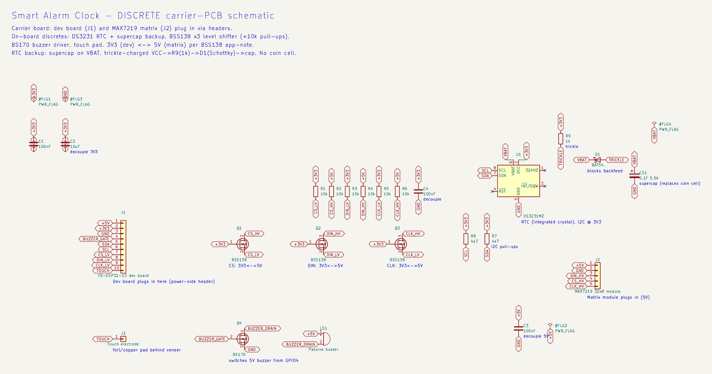

# Hardware

The custom PCB and enclosure, plus the breadboard bench validation that has to pass
before either gets built. The bench board so far is a YD-ESP32-S3 devkit
(ESP32-S3-WROOM-1). The reasoning behind the design choices is in
[`../docs/handoff.md`](../docs/handoff.md).

## Components (v1)

- MCU: ESP32-S3-WROOM-1 with native USB-JTAG. Bench board is a YD-ESP32-S3 devkit.
- Time: SNTP, with a DS3231 RTC and a supercap for backup. No coin cell.
- Power: USB-C mains, 5 V stepped down to 3.3 V. The supercap only backs the RTC.
- Display: a monochrome dot-matrix showing the time, behind wood veneer, dark when
  idle. The bench uses a red MAX7219 32×8; the final panel will be a warm/amber
  emitter picked at the PCB stage. Status (armed, ringing, and so on) shows on the
  onboard WS2812 RGB LED.
- Interaction: the ESP32-S3's built-in capacitive touch, a foil or copper pad behind
  the veneer with a tap/hold grammar. It reads through wood, which sidesteps the
  IR-through-veneer problem. Rear buttons are available too.
- Audio: a passive buzzer driven by LEDC/PWM through a BS170 low-side switch. Real
  audio is a possible later addition (see below).

## Bench validation

The point of this stage is to get the whole device working on a breadboard before
committing to a PCB. Each part below already has a firmware hook, or is the next
thing to wire. It uses the dev board and buttons already on hand. Sourcing is EU
(Tinytronics, Antratek, AliExpress); the prices are rough guides.

### Parts

Everything came from Tinytronics except the veneer (and, later, the copper tape).

| Part | Serves | Firmware hook | ~€ |
|---|---|---|---|
| **LED Matrix 32×8 with MAX7219** (red, 3-wire SPI-like; SKU 003516) | shows `HH:MM` (time only) — validate 4-digit layout/legibility/geometry behind veneer | matrix time render (to wire) | 6 |
| **Keyestudio DS3231 RTC** module (I²C, SKU 005849) | correct time on boot + offline alarm firing | RTC read/set fallback (scaffolded) | 4 |
| **Passive Buzzer 3-12V — Dupont-Jumper** (passive → PWM tones) | v1 wake sound | LEDC/PWM (`buzzer.rs`) | 1 |
| **4-channel Bi-Directional Logic Level Converter** (3.3↔5 V, BSS138) | reliable data into the 5 V MAX7219 from 3.3 V ESP32 | — | 1.5 |
| **Capacitive-touch electrode** — kitchen foil / jumper (proper copper tape later, *not* at Tinytronics) | tap + hold gestures via the ESP32-S3's **native** touch peripheral, no sensor chip | touch → `Command` bus (to wire) | ~0 |
| **Wood veneer sample pack** (~0.6 mm; walnut/oak/etc.) — *source elsewhere* | display glow-through look **and** capacitive-touch-through-veneer tuning | — | 5–10 |
| Decoupling caps (100 nF / 10 µF) | supporting | — | 2 |
| *Optional:* single **SK6812 / WS2812** discrete pixel | final placement of the RGB status LED (onboard WS2812 covers the bench) | already driven in `led.rs` | 1–2 |
| *Optional:* **Logic Analyzer 8-channel USB** | SPI/I²C bring-up debugging (sigrok/PulseView) | — | 9.75 |

The core is about €12.50 (matrix, RTC, buzzer, level converter), plus roughly €10 for
the optional logic analyzer. It's worth ordering a spare matrix and a spare level
converter. They don't wear out, but a wiring slip in the mixed 3.3/5 V path is easy to
make, and a reorder's shipping and wait cost more than the part does.

Status (2026-07-27): the electronics arrived; the veneer still needs sourcing. The
buzzer firmware is written. Breadboard bring-up was waiting on a soldering iron to
attach the dev-board header.

### Wiring

Every signal lands on the YD-ESP32-S3 power-side header (the `5Vin` / `3V3` / `RST`
row), so one soldered header covers the whole bench. The diagram below is logical
(what connects to what), not a physical breadboard layout.

It's a hybrid [KiCad schematic](KiCad/SmartAlarmClock/): the ESP32-S3-WROOM-1, BS170,
buzzer, and decoupling caps are real library symbols, while the RTC, matrix, and
level-shifter breakouts are drawn as blocks (the stock libraries only carry their bare
chips). Nets join by matching global-label names. `+5V` is the devkit's `5Vin` rail
(USB VBUS); the WROOM module has no 5 V pin of its own.

| Function | Pin | Notes |
|---|---|---|
| Buzzer | `GPIO4` | LEDC PWM → BS170 gate (low-side switch); internal pulldown, no external resistor |
| RTC SDA / SCL | `GPIO8` / `GPIO9` | I²C; **power the DS3231 at 3.3 V** (pull-ups reference VCC); scan should ACK at `0x68` |
| Matrix CS / DIN / CLK | `GPIO10` / `GPIO11` / `GPIO12` | native FSPI pins; **5 V logic** → drive through the level shifter |
| Cap touch | `GPIO14` | foil electrode; **no pull resistor** (interferes with sensing) |
| Power | `5Vin` / `3V3` / `GND` | `5Vin` = USB VBUS (5 V out when USB-powered); matrix VCC on `5Vin`, keep brightness modest |

A few things worth watching:

- Check the BS170's Drain and Source against your part's datasheet. The pinout is
  manufacturer-dependent (BS170 and 2N7000 are mirror images), and swapping D/S is the
  classic "won't switch" bug.
- Avoid `GPIO46` (LOG) and `GPIO3` (JTAG) on that header; both are strapping pins.
- The onboard WS2812 status LED is `GPIO48`, on the opposite header, left free for the
  phase-color LED.
- No loose resistors are needed: the module pull-ups and the BS170's internal gate
  pulldown cover it.
- If capacitive touch feels wrong, the fallback is a GY-APDS-9900 IR-reflective
  proximity module (I²C, about €3.50), which brings the IR-through-veneer test back.

### Bring-up sequence

1. Solder the dev-board header, then bring up the peripherals one at a time: RTC (I²C
   scan → `0x68`), buzzer, MAX7219 `HH:MM` render, capacitive touch. Prove the `HH:MM`
   glow, touch-through-veneer, and the warm look before a PCB.
2. Flesh out the firmware on the breadboard: RTC read, matrix render, touch input and
   tuning, NVS persistence.
3. KiCad schematic → ERC → 2-layer layout → DRC → Gerbers → order.
4. Bring up the bare board incrementally; iterate the veneer enclosure.

### Deferred to the PCB stage (the bench uses the simpler thing)

- RTC backup with a supercap instead of a coin cell. The supercap goes on the DS3231
  VBAT pin (across the coin-cell pads), not VCC — VBAT is the low-power (~1 µA) backup
  input. The DS3231 doesn't charge VBAT, so add a trickle path from VCC:
  `VCC → R (few hundred Ω–1k) → Schottky → supercap → GND`, with the cap rated at or
  above VCC (VBAT tops out at 5.5 V). On the bench, just use the CR1220.
- The warm display emitter. The bench matrix is red; source a warm/amber ~32×8 emitter
  once the veneer test confirms the geometry.

## Future option: real audio / HA media player

The v1 buzzer could later give way to real audio: a default tone stored on the device
for an offline wake sound, user-uploadable sound files, and registering as an HA
`media_player` so HA can push TTS, chimes, or radio. That needs about €20 of extra
parts: an ESP32-S3-DevKitC-1 N16R8 (16 MB flash for uploads and 8 MB PSRAM to
buffer/decode streams, neither of which the current board has), a MAX98357A I²S amp,
and a 3–4 W speaker. Two decisions are still open: WAV vs MP3 for uploads, and Rust vs
ESPHome for the `media_player`. The Rust path is a large firmware lift; ESPHome
provides it natively but would replace the current firmware.

## PCB and enclosure (after bench validation)

- A 2-layer KiCad design: schematic → ERC → layout → DRC → Gerbers → fab (JLCPCB vs
  Aisler in the EU). 0805 passives, module antenna, hand-soldered for v1.
- A wood-veneer bar enclosure: the matrix glows through the veneer, with a concealed
  USB-C port and hidden fasteners.

### Discrete carrier-PCB schematic (draft)

There's a first-draft [discrete schematic](KiCad/SmartAlarmClock_discrete/) for the
custom board. It's a carrier: the YD-ESP32-S3 dev board (J1) and the MAX7219 matrix
module (J2) plug in via headers, while the board itself carries the discrete glue — a
DS3231 RTC with supercap backup (trickle-charged `+3V3 → R9 → Schottky → supercap` on
VBAT, no coin cell), a BSS138 3-channel level shifter (with 10k pull-ups) for the
3.3↔5 V matrix lines, the BS170 buzzer driver, a touch-electrode pad, and decoupling.
It's ERC-clean (0 errors, 0 warnings).

## Open questions

- Warm display-emitter sourcing (the bench uses red).
- Capacitive-touch-through-veneer tuning: electrode size, thresholds, and behaviour on
  a groundless USB supply.
- Per-slot fields (repeat days, sound, sunrise), which drive the HA entity set and the
  NVS schema.
- Enclosure dimensions; budget and fab (JLCPCB vs Aisler).
