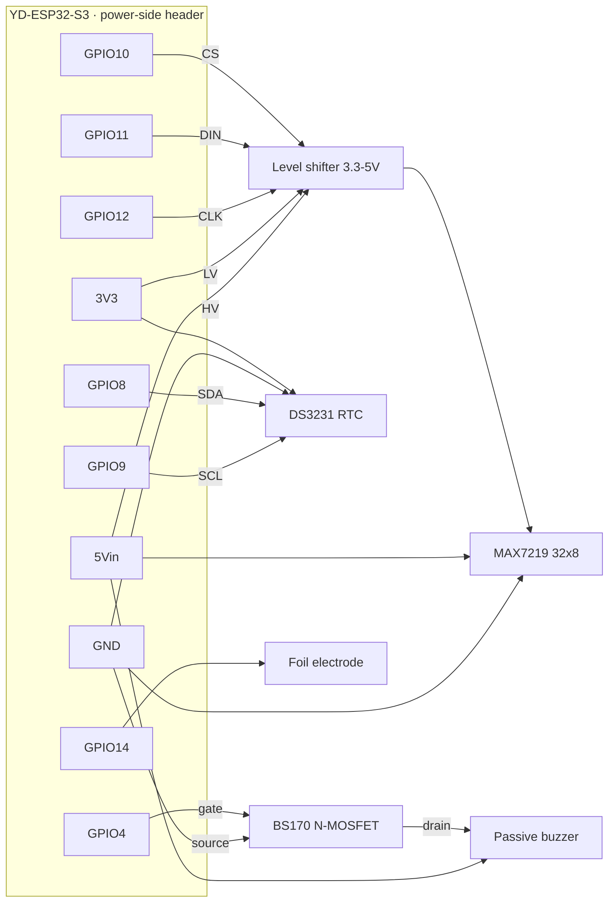

# Bench Wiring (high-level)

Breadboard wiring for the bench-validation phase (see [README → Bench validation](../README.md#bench-validation)).
Board: **YD-ESP32-S3** (VCC-GND Studio). Every signal below lands on the **power-side header**
(the row with `5Vin` / `3V3` / `RST`), so a single soldered header covers the whole bench.

This is a *logical* what-connects-to-what diagram, not a physical breadboard layout.

## Pin plan

| Function | Pin | Notes |
|---|---|---|
| Buzzer | `GPIO4` | LEDC PWM → BS170 gate (low-side switch); internal pulldown |
| RTC SDA / SCL | `GPIO8` / `GPIO9` | I²C; **power the DS3231 at 3.3 V** (its pull-ups reference VCC) |
| Matrix CS / DIN / CLK | `GPIO10` / `GPIO11` / `GPIO12` | = native FSPI pins; through the 3.3→5 V level shifter |
| Cap touch | `GPIO14` | foil electrode; **no pull resistor** (interferes with sensing) |
| Power | `5Vin` / `3V3` / `GND` | `5Vin` = USB VBUS (5 V out when USB-powered) |

## Notes / gotchas
- **BS170:** verify Drain vs Source against your part's datasheet — the pinout is
  manufacturer-dependent (BS170 ↔ 2N7000 are mirror images).
- **MAX7219 is 5 V logic** → drive its DIN/CLK/CS through the level shifter, matrix VCC on `5Vin`;
  keep brightness modest off USB power.
- **Avoid** `GPIO46` (LOG) and `GPIO3` (JTAG) on that header — both are strapping pins.
- Onboard WS2812 status LED is `GPIO48` (opposite header) — left free for the phase-color LED.
- Zero loose resistors: module-onboard pull-ups + the BS170's internal gate pulldown cover it.
